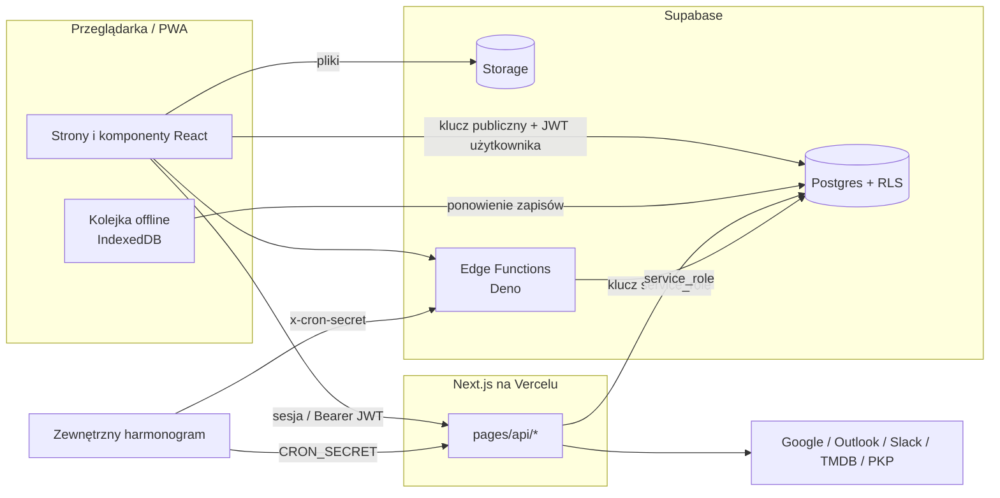

# Architektura Dzisiaj.Fun

Dokument dla osób, które zaczynają pracę z kodem: jak aplikacja jest zbudowana,
gdzie leży granica bezpieczeństwa i dlaczego niektóre rzeczy działają tak, a nie inaczej.
Instalacja i zmienne środowiskowe – zob. [README](../README.md).
Endpointy – [API.md](API.md). Operacje i awarie – [RUNBOOK.md](RUNBOOK.md).

## W skrócie

- **Next.js (Pages Router) na Vercelu** – interfejs i API (`pages/api`).
- **Supabase** – Postgres z RLS, uwierzytelnianie, Storage, Realtime, Edge Functions (Deno).
- **PWA** – service worker (`public/sw.js`) i kolejka zapisów offline (`lib/offlineQueue.ts`).
- **Integracje** – Kalendarz Google, Microsoft Outlook, Slack Lists, TMDB, PKP/PLK (rozkłady i status pociągów).

## Granica bezpieczeństwa

To najważniejsza część tego dokumentu.

1. **Klient rozmawia z bazą bezpośrednio** (kluczem publicznym i JWT zalogowanej osoby).
   Jedyną ochroną danych są więc **polityki RLS**. Każda tabela w `public` ma włączone RLS;
   nowa tabela bez polityk jest niedostępna dla klienta, nowa tabela z błędną polityką – dostępna dla wszystkich.
2. **API i Edge Functions używają klucza `service_role`**, który omija RLS. W tych miejscach
   kod sam musi sprawdzić, czy zasób należy do wywołującego (np. `slack/index.ts` sprawdza
   właściciela zadania, `exportTarget.ts` – właściciela kalendarza). Każdy nowy endpoint
   z `service_role` wymaga takiego sprawdzenia i testu „cudze id → 404”.
3. **Wiersze współdzielone** (`events`, `shopping_lists`, `tasks`) chroni dodatkowo trigger
   `enforce_shared_row_ownership`: `user_id` jest niezmienne, a udostępnienie zmienia tylko właściciel.
   Odbiorca wypisuje się z listy funkcją `leave_shared_shopping_list` (RLS nie pozwala mu na to zwykłym UPDATE).
4. **Tokeny zewnętrzne** (Google, Outlook, Slack) są szyfrowane AES-256-GCM (`lib/server/tokenCrypto.ts`).
   Tokeny Skrótów Siri przechowujemy tylko jako SHA-256.
5. **Funkcje `SECURITY DEFINER`** mają mieć pusty `search_path` i nie mogą być wywoływalne przez `anon`.
   Kontrola: `supabase/introspect_schema.sql` → sekcja `security_findings`.

## Przepływy danych

### Synchronizacja kalendarzy
- Podłączenie konta: OAuth (`/api/google-calendar?action=auth-url` → callback). Wiersz
  `connected_calendars` z `google_calendar_id = '@account_connection'` przechowuje tokeny konta;
  pozostałe wiersze to poszczególne kalendarze.
- Import cykliczny: `/api/calendar/sync-calendars` (cron). Wydarzenia są upsertowane po parze
  `(calendar_id, google_event_id)`; usunięte u dostawcy znikają z aplikacji (w oknie synchronizacji).
  **Kalendarz zewnętrzny jest źródłem prawdy** – lokalne edycje zaimportowanych wydarzeń są nadpisywane,
  z wyjątkiem udostępnienia (`shared_with_id`).
- Eksport (pole „Dodaj do” w formularzu, finalizacja ankiet): `?action=export` z `connectedCalendarId`.
  Wysłane wydarzenie dostaje `calendar_id` i `google_event_id`, dzięki czemu cron go nie duplikuje.
  Wydarzenia cykliczne zostają tylko w aplikacji.

### Slack Lists
- Dwukierunkowa synchronizacja zadań z kategorią Slack (`lib/server/slackSync/*`).
- Zapytania do Slacka są **celowo sekwencyjne** (limity API, nagłówek `Retry-After`) – stąd
  komentarze `// NOSONAR` przy `await` w pętlach.
- Zadanie usunięte w aplikacji trafia do `slack_deleted_tasks` (trigger na `tasks`), a następna
  synchronizacja usuwa element w Slacku.

### Ankiety terminów (meeting polls)
- Organizator tworzy ankietę; uczestnicy odpowiadają **bez konta** pod `/meet/[token]`.
- Finalizacja (`/api/meeting-polls/[id]/finalize`) jest jednorazowa (`finalized_at`) i przy błędzie
  wycofuje utworzone wydarzenia.

### Offline
- Zapisy wykonane bez sieci trafiają do kolejki w IndexedDB i są wysyłane **w kolejności dodania** po odzyskaniu połączenia.

## Ważne decyzje i ich koszty

| Decyzja | Dlaczego | Koszt |
|---|---|---|
| Klient pisze do bazy bezpośrednio | Mniej kodu API, działa offline | Cała autoryzacja w RLS – błędna polityka = wyciek |
| Migracje poza repozytorium (od 1.38.7) | Migracja bazowa nie odpowiadała produkcji | Zmiany schematu nie są wersjonowane; zob. RUNBOOK |
| Zewnętrzny kalendarz jako źródło prawdy | Brak konfliktów przy synchronizacji | Edycje zaimportowanych wydarzeń w aplikacji znikają |
| Sekwencyjne zapytania do Slacka | Limity API | Synchronizacja dużych list trwa dłużej |
| Pula równoległości (`lib/asyncPool.ts`) dla niezależnych operacji | Krótszy czas cronów | Błąd jednej operacji odrzuca całą pulę, jeśli nie jest łapany w środku |

## Struktura katalogów (najważniejsze)

| Ścieżka | Zawartość |
|---|---|
| `pages/` | Strony; `pages/api/` – endpointy (zob. API.md) |
| `components/` | Komponenty UI pogrupowane według modułów; `components/ui/` – wspólne |
| `hooks/db/` | Dostęp do danych (Supabase) z optymistycznymi aktualizacjami |
| `lib/` | Logika bez Reacta; `lib/server/` – tylko po stronie serwera |
| `supabase/functions/` | Edge Functions; `_shared/` – kod wspólny (kopie helperów z `lib/`) |
| `supabase/introspect_schema.sql` | Zrzut schematu i audyt bezpieczeństwa bazy |
| `__tests__/` | Vitest + Testing Library |
